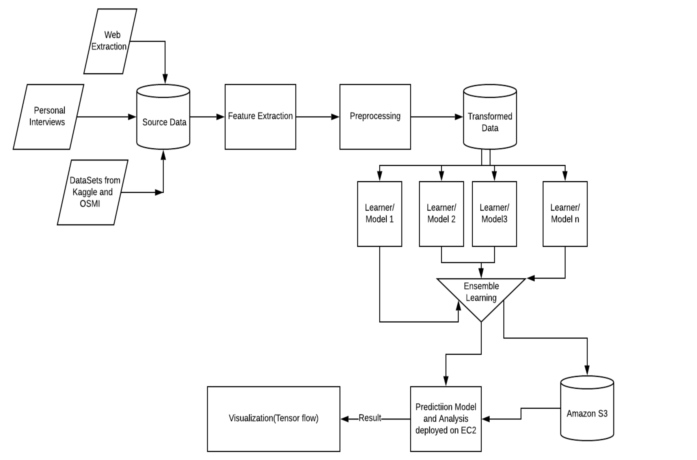

# MentalHealth - Group-4

### Team Members
* Alok Goyal 
* Shalabh Neema 
* Pratyush Sharma 
* Kunika Mittal 
##
   
 **Title** : **Mental health in Tech Industry** 
 
**Abstract**

Mental health is among the growing contributors to poor health and workplace accidents. Employees around the world are suffering from different mental health issues that are not being discussed and addressed by employers mostly. The stigma around mental health dissuades most of the people from talking about it with their peers and pushes them into a bottomless pit.
 
Employers need to develop a conducive environment in the workplace where mental health is considered as normal as the physical health and proper help is extended to the employees suffering from it. We aim to inform the employer about the state of mental health of their tech employees and provide them with actionable insights that can help them improve the work environment.

**Description**

This project aims to understand the mental health conditions in the flourishing tech industries. OSMI -Open Source Mental Illness has taken various surveys which gives us huge data on the current perception of mental health of both employees and employers. This project aims to analyze the relationship between the parameters which may be responsible for influencing the mental health of the affected person. 

We are aiming to explore the following questions:
a) How does the frequency of mental health illness and attitude towards mental health vary by geographic location?
b) How do the tech industries respond to the issue of mental health and how do they deal with it?
c) Steps to identify the stealth symptoms of the mental health illness at the workplace?
d) Suggest corrective measures to the employers that can help them create a conducive work environment.
e) Measure the effectiveness of the solution applied by the tech companies to handle the multiple issues.

**Architecture Diagram**

 

**Technology Stack**

Machine Learning, Tensor flow, AWS, WebHarvey